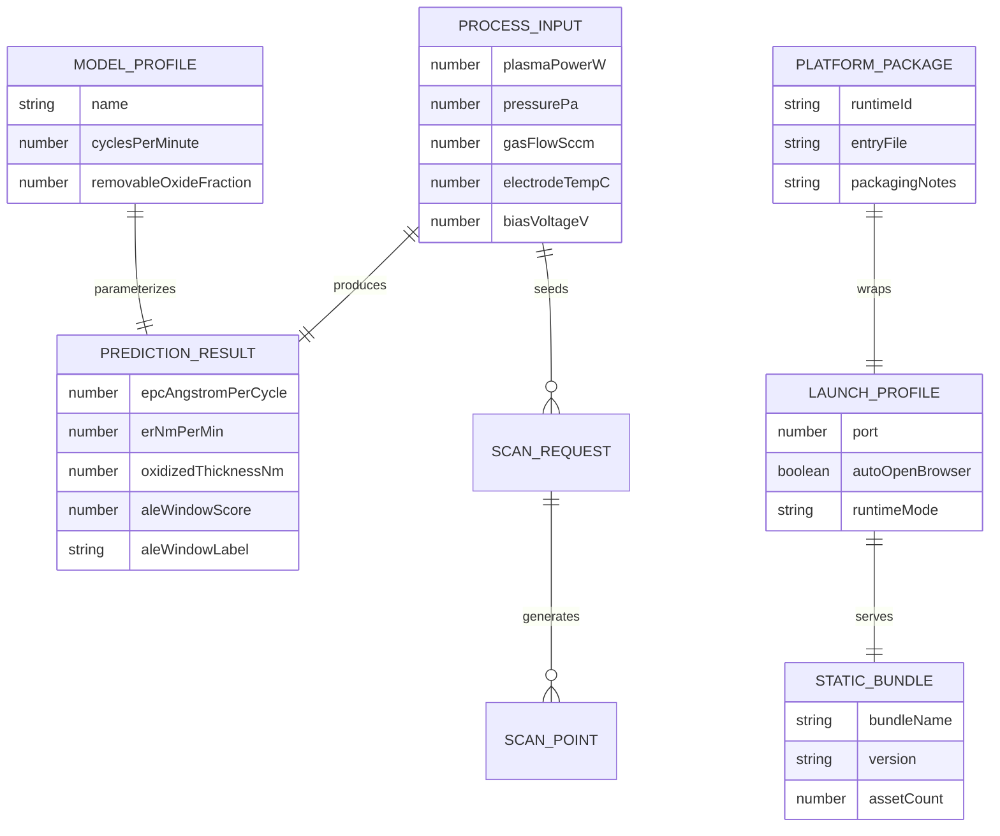
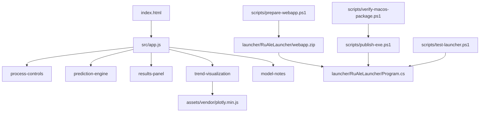

# Ru ALE 预测计算器架构设计

## 1. 架构目标
本项目是一个面向研究人员的 Ru ALE 演示计算器。核心页面继续采用纯前端 HTML/CSS/JavaScript，输入 `Plasma power / Pressure / Gas flow / Electrode temperature / Bias voltage`，输出 `EPC / ER / Oxidized thickness / ALE window`，并展示单参数曲线、多参数联动趋势图与完整公式说明。

在现有页面基础上，新增跨平台启动器分发能力：
- Windows：单文件 exe，双击后启动本地静态服务并自动打开浏览器
- macOS Intel：`osx-x64` 自包含可执行文件 + `.command` 启动脚本，双击后打开 Terminal 并自动在浏览器中打开页面

## 2. 技术选型深度分析

| 领域 | 推荐方案 | 备选方案 | 选择理由 |
|---|---|---|---|
| 页面层 | `HTML + CSS + ES Modules` | React / Vue | 页面已经完成，原生方案最轻，易于被本地静态服务直接托管 |
| 图表层 | `Plotly.js (本地静态资源)` | ECharts / Chart.js | 保持现有图表能力，同时去除对 CDN 的依赖 |
| 状态管理 | `轻量自定义 store` | 全局对象 / Redux 类库 | 当前状态规模小，现有结构足够 |
| 模型层 | `前端确定性机理启发模型` | 后端 Python 模型 / ML 回归 | 保持可解释、离线可运行的前端预测逻辑 |
| 桌面启动层 | `.NET 9 控制台程序 + HttpListener` | Electron / Tauri / Go 静态服务器 | 体积更小、启动更直接、目标机器无需 Node；当前环境已具备 .NET 9 |
| Windows 打包模式 | `.NET single-file self-contained` | Native AOT | Native AOT 需要额外 C++ 工具链；当前环境无 `cl.exe` |
| macOS Intel 打包模式 | `.NET self-contained osx-x64 publish + .command wrapper` | Electron app bundle | 体积更小，生成简单，符合“可接受 Terminal 弹出”的要求 |
| 构建脚本 | `PowerShell` | bash / Node scripts | 当前运行环境为 Windows + PowerShell，适合静态资源准备与发布脚本 |

推荐最终栈：
- 运行时：`HTML + CSS + JavaScript + 本地 Plotly.js`
- 启动器：`.NET 9 console app`
- 构建辅助：`pnpm + Vitest + PowerShell + dotnet publish`

## 3. 页面与交互结构
页面 UI 结构保持不变：
- 左侧为参数输入区
- 右侧顶部为结果卡片
- 中部为单参数扫描曲线图
- 下部为双参数联动热力图
- 底部为模型假设与完整公式面板

新增启动流程：
### Windows
1. 用户双击 exe。
2. 启动器准备前端静态资源。
3. 启动本地 `http://127.0.0.1:<port>` 静态服务。
4. 自动打开默认浏览器访问该地址。

### macOS Intel
1. 用户双击 `start.command`。
2. Terminal 打开并执行 `RuAleLauncher`。
3. 启动本地 `http://127.0.0.1:<port>` 静态服务。
4. 自动打开默认浏览器访问该地址。

## 4. 完整目录结构
```text
D:/project/nano/
├─ index.html
├─ package.json
├─ assets/
│  ├─ styles/
│  │  └─ main.css
│  └─ vendor/
│     └─ plotly.min.js
├─ src/
├─ launcher/
│  └─ RuAleLauncher/
│     ├─ RuAleLauncher.csproj
│     ├─ Program.cs
│     └─ webapp.zip                        # 构建时生成
├─ scripts/
│  ├─ prepare-webapp.ps1
│  ├─ publish-exe.ps1                     # 现有发布脚本，扩展支持 osx-x64
│  ├─ test-launcher.ps1
│  ├─ test-published-exe.ps1
│  └─ verify-macos-package.ps1            # 检查 macOS 产物结构
├─ dist/
│  ├─ win-x64/
│  │  └─ RuAleLauncher.exe
│  └─ osx-x64/
│     ├─ RuAleLauncher                    # macOS Intel 可执行文件
│     ├─ start.command                    # 双击启动脚本
│     └─ README-macos.txt                 # 首次运行说明
└─ tests/
```

## 5. 模块划分与职责定义

| 模块 | 职责 | 对外接口 | 依赖 |
|---|---|---|---|
| `process-controls` | 管理输入参数、默认值、校验规则和扫描配置 | `mountControls(container, store)` | `shared/state`, `shared/utils/validation` |
| `prediction-engine` | 根据输入计算氧化厚度、EPC、ER 和 window score | `calculatePrediction(input)` | `reaction-kernels`, `window-classifier` |
| `results-panel` | 显示结果卡片、趋势摘要、警告信息 | `renderResults(result)` | `shared/utils/format` |
| `trend-visualization` | 渲染单参数曲线与双参数热力图 | `renderSingleScan(...)`, `renderWindowMap(...)` | `prediction-engine`, `Plotly.js` |
| `model-notes` | 展示完整公式、阈值和中间量 | `mountModelNotes(container, store)` | `shared/utils/format` |
| `launcher` | 启动本地静态服务、打开浏览器、提供控制台生命周期 | `Program.Main(args)` | `.NET 9`, `HttpListener` |
| `publish scripts` | 准备静态资源包、发布 Windows/macOS 包、验证产物结构 | `prepare-webapp.ps1`, `publish-exe.ps1`, `verify-macos-package.ps1` | PowerShell, dotnet |

## 6. 核心计算设计
前端模型公式不变，继续使用现有机理启发模型。页面完整展示公式和中间量。

## 7. 启动器接口 / 运行设计
本项目没有业务 HTTP API；启动器只提供静态文件托管。

### 浏览器访问入口
- `GET /` → 返回 `index.html`
- `GET /assets/...` → 返回 CSS / vendor JS
- `GET /src/...` → 返回前端模块 JS

### 启动器命令行参数
- `--port <number>`：指定端口，便于测试
- `--no-browser`：启动服务但不自动打开浏览器

### 平台包装行为
- Windows：输出 `RuAleLauncher.exe`
- macOS Intel：输出 `RuAleLauncher` 与 `start.command`
- macOS 包额外附带 `README-macos.txt`，说明首次未签名运行和 `chmod +x` 处理方式

## 8. 数据模型（Mermaid ER 图）


## 9. 模块依赖关系图（Mermaid）


## 10. 关键设计决策
- 不引入 Electron，优先控制最终体积。
- 图表库使用本地静态资源，避免运行时依赖外网。
- 启动器使用浏览器承载页面，而不是嵌入式 WebView，减少复杂度。
- Windows 版本继续使用 `.NET single-file self-contained`。
- macOS Intel 版本采用 `osx-x64` 交叉发布，并通过 `.command` 包装启动。
- 当前环境无法直接运行 macOS 产物，因此自动验证聚焦于“发布成功”和“包结构正确”；实际运行由 Intel Mac 手动验收。
- 所有涉及启动流程和页面加载行为的任务都应视为需要手动验收。